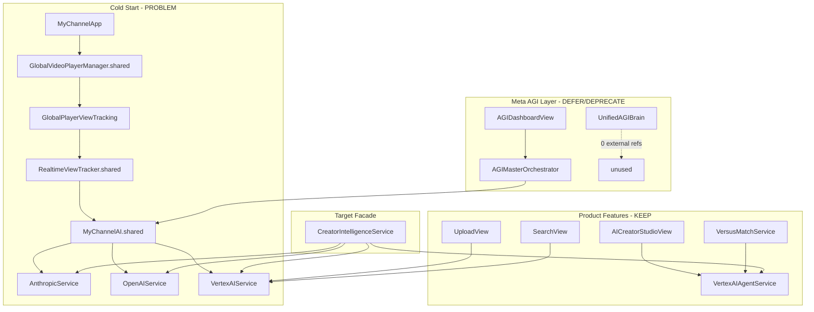

# AI/AGI Call-Site Map — MyChannel iOS

Generated: 2026-07-09  
Scope: `/MyChannel` Swift sources only (excludes `.md` docs, tests, `web-v2/`)

## Cold-start fix applied (2026-07-09)

Removed unused `MyChannelAI.shared` property from `RealtimeViewTracker.swift` so
`GlobalVideoPlayerManager` → view tracking no longer cold-starts the AGI stack.
See recommendation #1 above.

---

## Summary Table

| Name | External call sites | Cold-start? | Recommendation |
|------|--------------------:|-------------|----------------|
| **AGIMasterOrchestrator** | 1 | No (Settings → AGI Dashboard only) | **defer** — admin/debug shell; gate behind Settings |
| **UnifiedAGIBrain** | 0 | No (never referenced externally) | **deprecate** — dead orchestrator; fold useful bits into facade |
| **SuperAGI** | 1 | No (only via UnifiedAGIBrain) | **deprecate** — theatrical metrics layer; no product callers |
| **EnterpriseAITeam** | 2 | No | **defer** — demo team UI + UnifiedAGIBrain wiring only |
| **MyChannelAI** | 6 | **Yes** ⚠️ | **defer** — remove eager init from view-tracking path; expose via facade |
| **AIConversationOrchestrator** | 3 | No (pulled in by AGIMasterOrchestrator / MyChannelAI init) | **defer** — background debate loop; not user-facing |
| **AnthropicService** | 19 (11 files) | Indirect via MyChannelAI chain | **keep** — production Claude backend |

### AnthropicService call-site map (batch-7)

| File | Usage |
|------|-------|
| `Core/Services/AIConversationOrchestrator.swift` | Debate loop (deferred) |
| `Core/Services/EnterpriseAITeam.swift` | Demo team agents (deferred) |
| `Core/Services/ChannelMindAGI.swift` | AGI dashboard explanations |
| `Core/Services/MyChannelDoctorService.swift` | Doctor diagnostics |
| `Core/Services/AIOptimizationService.swift` | Metadata optimization fallback |
| `Core/Services/SmartUserSeederService.swift` | Seed name generation |
| `Core/AI/SafetyAgents.swift` | Safety prompts |
| `Core/Services/MyChannelAI.swift` | Teacher model (facade) |

**Rule:** New UI call sites → `CreatorIntelligenceService`, not `AnthropicService.shared`.

| **OpenAIService** | 18 (11 files) | Indirect via MyChannelAI chain | **keep** — production GPT backend |
| **OpenAIAgentService** | 4 (3 files) | Deferred (~2s, background) | **keep** — already lazy in LazyServiceManager |
| **VertexAIService** | 9 (8 files) | Indirect via MyChannelAI chain | **keep** — production Gemini backend |
| **VertexAIAgentService** | 8 (8 files) | On-demand (Studio/Upload/Gaming views) | **keep** — highest product-value agent surface |

---

## Cold-Start Analysis (LazyServiceManager + App Launch)

### LazyServiceManager (`Core/Performance/LazyServiceManager.swift`)

| Tier | AI-related registration | Notes |
|------|-------------------------|-------|
| **critical / high / medium** | None directly named | `UserSeeder` (medium) may call Anthropic/OpenAI **later** during seed generation, not at `initialize()` |
| **low** | — | No AI singletons |
| **deferred** | `OpenAIAgent`, `PerspectiveModeration`, `AutoCaption`, `Doctor` | `OpenAIAgent` explicitly deferred with comment: *"AI agents deferred — do not touch cold-start path"* (line 145–148) |

### App launch chain (`MyChannelApp.swift`)

```
MyChannelApp @StateObject GlobalVideoPlayerManager.shared   (line 38)
  → GlobalVideoPlayerManager.private init()                   (line 80)
    → GlobalPlayerViewTracking.init()                         (GlobalPlayerViewTracking.swift:39)
      → RealtimeViewTracker.shared                            (line 25)
        → MyChannelAI.shared                                  (RealtimeViewTracker.swift:37) ⚠️
          → AnthropicService.shared                           (MyChannelAI.swift:49)
          → OpenAIService.shared                              (MyChannelAI.swift:50)
          → VertexAIService.shared                            (MyChannelAI.swift:51)
          → startContinuousTraining() + startAIConversations() (MyChannelAI.swift:53–56)
```

**Finding:** `MyChannelAI` is **not** registered in `LazyServiceManager`, but it **does** initialize on cold start because `RealtimeViewTracker` holds `MyChannelAI.shared` as an unused stored property (declared line 37, never referenced elsewhere in the file). This is the highest-impact launch regression in the AGI stack.

**Safe follow-up (not applied in this pass):** Remove the dead `aiService` property from `RealtimeViewTracker` or replace with lazy `ensureLoaded` behind `CreatorIntelligenceService`. No LazyServiceManager tier change needed — the issue is the `GlobalVideoPlayerManager` → view-tracking chain.

---

## Per-Orchestrator Details (top 5 external sites each)

### 1. AGIMasterOrchestrator

**Definition:** `Core/Services/AGIMasterOrchestrator.swift`  
**External call sites:** 1

| File:Line | Evidence |
|-----------|----------|
| `Features/AI/AGIDashboardView.swift:13` | `@StateObject private var masterOrchestrator = AGIMasterOrchestrator.shared` |

**Reachability:** `Features/Settings/SettingsView.swift:372` → `NavigationLink(destination: AGIDashboardView())`

**Internal cascade on init:** Pulls `MyChannelAI`, `AIConversationOrchestrator`, `ChannelMindAGI`, `MetaLearningEngine`, etc. (`AGIMasterOrchestrator.swift:36–42, 72–80`)

---

### 2. UnifiedAGIBrain

**Definition:** `Core/AI/UnifiedAGIBrain.swift`  
**External call sites:** **0**

No file outside `UnifiedAGIBrain.swift` references `UnifiedAGIBrain.shared` or constructs `UnifiedAGIBrain()`.

**Internal wiring only** (same file): `SuperAGI.shared:26`, `EnterpriseAITeam.shared:44`, `AIConversationOrchestrator.shared:48`, `MyChannelAI.shared:49`

---

### 3. SuperAGI

**Definition:** `Core/AI/SuperAGI.swift`  
**External call sites:** 1

| File:Line | Evidence |
|-----------|----------|
| `Core/AI/UnifiedAGIBrain.swift:26` | `private let superAGI = SuperAGI.shared` |

No product feature, view, or service outside the AGI meta-layer references SuperAGI.

---

### 4. EnterpriseAITeam

**Definition:** `Core/Services/EnterpriseAITeam.swift`  
**External call sites:** 2

| File:Line | Evidence |
|-----------|----------|
| `Features/AI/AGIDashboardView.swift:21` | `@StateObject private var enterpriseTeam = EnterpriseAITeam.shared` |
| `Core/AI/UnifiedAGIBrain.swift:44` | `private let enterpriseAI = EnterpriseAITeam.shared` |

*Note:* `AICrystalBall.swift:217` is a comment only — not a call site.

**Anthropic usage inside definition file:** 8 `AnthropicService.shared.sendMessage` calls (lines 131, 154, 171, 428, 658, 753, 805, 909).

---

### 5. MyChannelAI

**Definition:** `Core/Services/MyChannelAI.swift` (+ extension stub in `AIConversationOrchestrator.swift:329`)  
**External call sites:** 6

| File:Line | Evidence |
|-----------|----------|
| `Core/Services/RealtimeViewTracker.swift:37` | `private let aiService = MyChannelAI.shared` ⚠️ **cold-start** |
| `Features/AI/AGIDashboardView.swift:14` | `@StateObject private var myChannelAI = MyChannelAI.shared` |
| `Core/Services/AGIMasterOrchestrator.swift:36` | `private let myChannelAI = MyChannelAI.shared` |
| `Core/AI/UnifiedAGIBrain.swift:49` | `private let centralAI = MyChannelAI.shared` |
| `Core/Services/AIConversationOrchestrator.swift:28` | `private let yourAI = MyChannelAI.shared` |
| `Core/Services/MetaLearningEngine.swift:168` | `MyChannelAI.shared.intelligenceLevel += 1.0` |

**Init side effects** (`MyChannelAI.swift:53–56`): `loadModel()`, `startContinuousTraining()`, `startAIConversations()` — runs on first `.shared` access.

---

### 6. AIConversationOrchestrator

**Definition:** `Core/Services/AIConversationOrchestrator.swift`  
**External call sites:** 3

| File:Line | Evidence |
|-----------|----------|
| `Features/AI/AGIDashboardView.swift:19` | `@StateObject private var conversationOrchestrator = AIConversationOrchestrator.shared` |
| `Core/Services/AGIMasterOrchestrator.swift:41` | `private let conversationOrchestrator = AIConversationOrchestrator.shared` |
| `Core/AI/UnifiedAGIBrain.swift:48` | `private let conversationAI = AIConversationOrchestrator.shared` |

**Init side effect:** `startConversationLoop()` (`AIConversationOrchestrator.swift:32–34`)

---

### 7. AnthropicService

**Definition:** `Core/Services/AnthropicService.swift`  
**External call sites:** 19 lines across 11 files

| File:Line | Evidence |
|-----------|----------|
| `Core/Services/MyChannelAI.swift:49` | `private let claude = AnthropicService.shared` |
| `Core/Services/EnterpriseAITeam.swift:131` | `AnthropicService.shared.sendMessage(prompt, model: …)` |
| `Core/Services/ChannelMindAGI.swift:157` | `AnthropicService.shared.sendMessage(prompt)` |
| `Core/Services/AIConversationOrchestrator.swift:25` | `private let claude = AnthropicService.shared` |
| `Core/Services/AISearchService.swift:20` | `private let claudeService = AnthropicService.shared` |

*Additional files:* `AIOptimizationService.swift`, `CreatorCategoryClassifier.swift`, `GrowthAgents.swift`, `MyChannelDoctorService.swift`, `SafetyAgents.swift`, `SmartUserSeederService.swift`

**Init:** lightweight (`AnthropicService.swift:22` — empty `private init()`)

---

### 8. OpenAIService / OpenAIAgentService

#### OpenAIService

**Definition:** `Core/Services/OpenAIService.swift`  
**External call sites:** 18 lines across 11 files

| File:Line | Evidence |
|-----------|----------|
| `Core/Services/MyChannelAI.swift:50` | `private let gpt = OpenAIService.shared` |
| `Core/Services/EnterpriseAITeam.swift:228` | `OpenAIService.shared.generate(prompt, model: .gpt5Turbo)` |
| `Core/Services/AIConversationOrchestrator.swift:26` | `private let gpt = OpenAIService.shared` |
| `Features/Studio/AIContentAssistantViewModel.swift:53` | `OpenAIService.shared.generate(prompt, model: .gpt5Turbo)` |
| `Core/Services/ModerationService.swift:77` | `private let openAIService = OpenAIService.shared` |

*Additional files:* `AICrystalBall.swift`, `AIOptimizationService.swift`, `AISearchService.swift`, `OpenAIAgentService.swift` (wrapper), `SmartUserSeederService.swift`, `VideoRepurposerViewModel.swift`

#### OpenAIAgentService

**Definition:** `Core/Services/OpenAIAgentService.swift`  
**External call sites:** 4

| File:Line | Evidence |
|-----------|----------|
| `Core/Performance/LazyServiceManager.swift:147` | `_ = OpenAIAgentService.shared` (`.deferred` tier) |
| `Core/AI/AGIAgentManager.swift:185` | `OpenAIAgentService.shared.isAvailable` |
| `Core/AI/AGIAgentManager.swift:187` | `OpenAIAgentService.shared.runAgentPrompt(…)` |
| `Core/Services/PerspectiveModerationService.swift:45` | `OpenAIAgentService.shared.moderateContent(text)` |

---

### 9. VertexAIService / VertexAIAgentService

#### VertexAIService

**Definition:** `Core/Services/VertexAIService.swift`  
**External call sites:** 9 lines across 8 files

| File:Line | Evidence |
|-----------|----------|
| `Core/Services/MyChannelAI.swift:51` | `private let gemini = VertexAIService.shared` |
| `Core/Services/AIConversationOrchestrator.swift:27` | `private let gemini = VertexAIService.shared` |
| `Features/Upload/UploadView.swift:1178` | `VertexAIService.shared.generateWithGemini(prompt)` |
| `Features/Search/SearchView.swift:604` | `VertexAIService.shared.generateWithGemini(prompt)` |
| `Core/Services/AISearchService.swift:21` | `private let geminiService = VertexAIService.shared` |

*Additional files:* `AIOptimizationService.swift`, `LiveTVIntelligenceAgent.swift`, `SearchSuggestionService.swift`, `SearchView.swift:621`

#### VertexAIAgentService

**Definition:** `Core/Services/VertexAIAgentService.swift`  
**External call sites:** 8

| File:Line | Evidence |
|-----------|----------|
| `Features/Studio/AICreatorStudioView.swift:13` | `@StateObject private var aiService = VertexAIAgentService.shared` |
| `Core/Services/AgentAPIService.swift:33` | `private let vertexAI = VertexAIAgentService.shared` |
| `Features/Gaming/VersusMatchService.swift:71` | `VertexAIAgentService.shared.orchestrateMatch(…)` |
| `Features/Upload/PostUploadEditorView.swift:864` | `VertexAIAgentService.shared.triageContent(…)` |
| `Core/Services/VSMatchWalletService.swift:103` | `VertexAIAgentService.shared.analyzeFraudRisk(…)` |

*Additional files:* `AISupportChatView.swift`, `CreatorAnalyticsDashboard.swift`, `ViralPredictorCard.swift`

**DependencyContainer:** `AgentAPIService.shared` registered (`DependencyContainer.swift:88`)

---

## Architecture Diagram (current vs target)



---

## Suggested `CreatorIntelligenceService` Facade Surface

A single `@MainActor` entry point that product code calls instead of orchestrator singletons. Route internally to Anthropic / OpenAI / Vertex based on task type and cost/latency policy.

```swift
@MainActor
protocol CreatorIntelligenceServing {
    /// Unified text generation for creator tools (studio, chat, insights).
    func generate(prompt: String, context: CreatorAIContext?, policy: AIRoutePolicy) async throws -> CreatorAIResponse

    /// Upload + studio metadata optimization (title, description, tags, thumbnails).
    func optimizeVideoMetadata(_ draft: VideoMetadataDraft) async throws -> VideoMetadataSuggestion

    /// Engagement / viral scoring for studio cards and post-upload triage.
    func scoreEngagement(for video: Video, signals: EngagementSignals) async throws -> EngagementScore

    /// Safety pass for UGC (text + optional media hints).
    func moderateContent(_ input: ModerationInput) async throws -> ModerationVerdict

    /// Search assistance: spell-fix, related queries, semantic suggestions.
    func assistSearch(query: String, locale: String) async throws -> SearchAIAssist

    /// High-level creator decision support (replaces direct ChannelMind / swarm calls).
    func recommendCreatorAction(_ context: CreatorDecisionContext) async throws -> CreatorActionPlan
}
```

**Routing policy sketch:**

| Method | Primary backend | Fallback |
|--------|----------------|----------|
| `optimizeVideoMetadata` | `VertexAIAgentService` | `VertexAIService` |
| `scoreEngagement` | `VertexAIAgentService.predictViralScore` | `OpenAIService` |
| `moderateContent` | `VertexAIAgentService` + `PerspectiveModerationService` | `AnthropicService` |
| `assistSearch` | `VertexAIService` | `AnthropicService` |
| `generate` / `recommendCreatorAction` | Task-specific; avoid `MyChannelAI` until training loop is opt-in |

---

## Top Recommendations (priority order)

1. **Break the cold-start chain** — Remove or lazy-load `MyChannelAI.shared` from `RealtimeViewTracker.swift:37` (property is unused). This stops `startContinuousTraining()` / `startAIConversations()` on every launch without touching AI files.

2. **Deprecate meta-orchestrators with zero product surface** — `UnifiedAGIBrain` (0 external refs) and `SuperAGI` (1 ref inside dead brain). Keep code, stop wiring new features through them.

3. **Gate AGI Dashboard stack** — `AGIMasterOrchestrator`, `EnterpriseAITeam`, `AIConversationOrchestrator`, `MyChannelAI` are effectively an admin playground reachable from Settings. Treat as debug-only; do not add production dependencies.

4. **Keep LLM service layer** — `AnthropicService`, `OpenAIService`, `VertexAIService`, `VertexAIAgentService` have real product call sites (Upload, Search, Studio, Gaming, Moderation). Consolidate access through `CreatorIntelligenceService`, not removal.

5. **Preserve deferred LazyServiceManager policy** — `OpenAIAgentService` is correctly `.deferred`. Do not promote AGI singletons into critical/high/medium tiers.

6. **Next refactor step** — Introduce `CreatorIntelligenceService` with the 6 methods above; migrate `UploadView`, `SearchView`, `AICreatorStudioView`, and `AgentAPIService` first (highest user value, already on-demand).

---

## Files Surveyed

| Type | Definition file |
|------|-----------------|
| AGIMasterOrchestrator | `Core/Services/AGIMasterOrchestrator.swift` |
| UnifiedAGIBrain | `Core/AI/UnifiedAGIBrain.swift` |
| SuperAGI | `Core/AI/SuperAGI.swift` |
| EnterpriseAITeam | `Core/Services/EnterpriseAITeam.swift` |
| MyChannelAI | `Core/Services/MyChannelAI.swift` |
| AIConversationOrchestrator | `Core/Services/AIConversationOrchestrator.swift` |
| AnthropicService | `Core/Services/AnthropicService.swift` |
| OpenAIService | `Core/Services/OpenAIService.swift` |
| OpenAIAgentService | `Core/Services/OpenAIAgentService.swift` |
| VertexAIService | `Core/Services/VertexAIService.swift` |
| VertexAIAgentService | `Core/Services/VertexAIAgentService.swift` |
